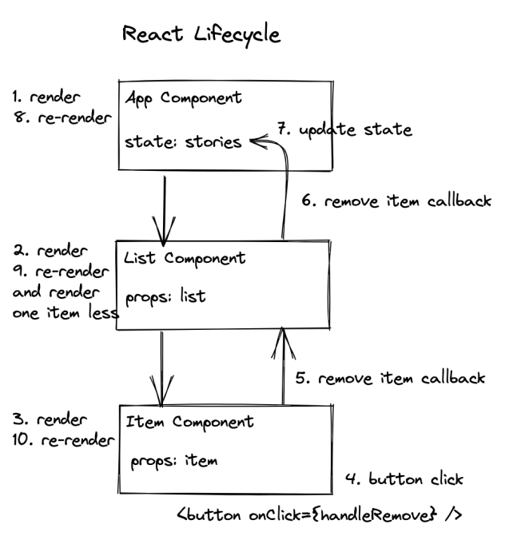

# useState

1. `useState` is one of the built-in hooks in React, designed to provide state management within functional components. When you call useState, it returns an array with two elements:

2. The current state value.
   A function to update that state value.

## Syntax :

## Here's how it works:

1. `Initialization:` When the component is first rendered, React initializes the state with the initial value provided to useState. This happens only once during the initial render.

2. `Rendering:` The component renders with the initial state value. Any JSX elements in the component that depend on the state will reflect the initial value.

3. `State Updates:` When the state needs to be updated, you call the updater function returned by useState. React schedules a re-render of the component with the updated state value. It doesn't immediately mutate the state; instead, it enqueues the update and batches multiple updates for better performance.

4. `Re-rendering:` After the state update is enqueued, React re-renders the component with the new state value. This ensures that any parts of the UI that depend on the state are updated to reflect the latest values.

5. `Optimization:` React optimizes the rendering process by only re-rendering the parts of the component that have changed. It compares the previous and current versions of the component's virtual DOM to determine what needs to be updated.

6. `Lifecycle:` The state is preserved between re-renders of the component. React manages the lifecycle of the state, ensuring that it persists and remains consistent throughout the component's lifespan.

Overall, useState provides a simple and intuitive way to manage state within functional components, allowing for dynamic and interactive user interfaces in React applications.

## Developing Application : ToDo List

1. **State Declaration:**
It is initialized using the useState hook: `const [todos, setTodos] = useState([]);`.
The todos variable holds the current state value, which is initially an empty array `([])`.
The `setTodos` function is used to update the `todos state`.

2. **Adding Todos:**
When a new todo is added, it's appended to the existing list of todos using the `spread operator` and then set as the new state: `setTodos([...todos, newTodo])`.
This preserves the previous todos while adding the new one.

3. **Deleting Todos:**
When a todo is deleted, a new array is created by copying the existing todos, removing the todo to delete using splice, and then updating the state with the new array: `setTodos(newTodos)`.

4. **Rendering Todos:**
The `todos` array is mapped over to render each todo item as a list item `(<li>)`.
Each todo item is displayed along with a `"Delete"` button that triggers the `handleDeleteTodo` function to remove the corresponding todo.
